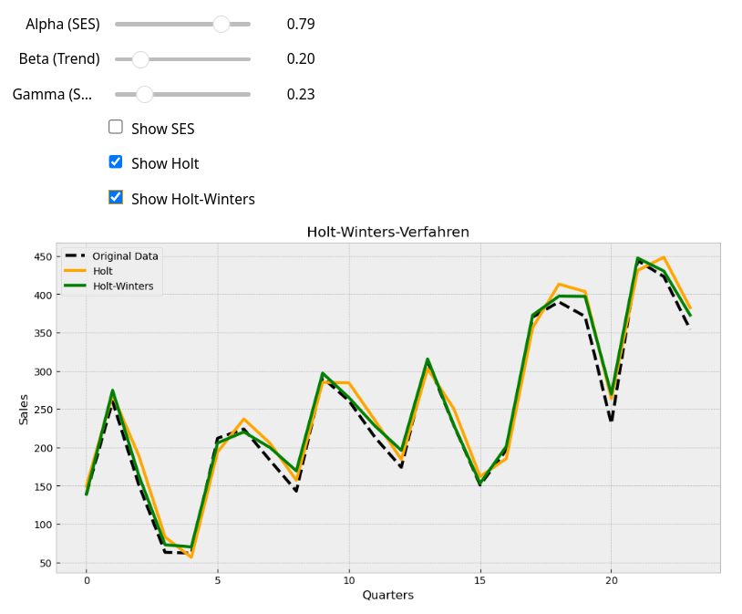

# Holt-Winters-Verfahren
This Project should visualise the exponential smoothing with Holt and Holt-Winters.

<!-- ABOUT THE PROJECT -->
## About The Project

This jupyter Notebook should help to understand the impact of alpha, beta and gamma for the Holt-Winters-Forecast.
It creates an interactive plot with salesdata with the Holt-Forecast as well as the Holt-Winters-Forecast.

<!-- BUILT WITH-->
## Built with

* [![Jupyter Logo][Jupyter.com]][Jupyter-url]

<!-- LICENSE -->
## License

Distributed under the MIT License. See `LICENSE.txt` for more information.

<!-- CONTACT -->
## Contact

* [private E-Mail](wesingerluis@gmail.com  )
* [Edu - Mail](luis.wesinger@st.oth-regensburg.de  )
* [Github Repository](https://github.com/luiswesinger/Holt-Winters-Verfahren)

<!-- MARKDOWN LINKS-->
[Jupyter.com]:https://img.shields.io/badge/Jupyter%20Notebook-F37626?style=flat-square&logo=jupyter&logoColor=white
[Jupyter-url]:https://jupyter.org/